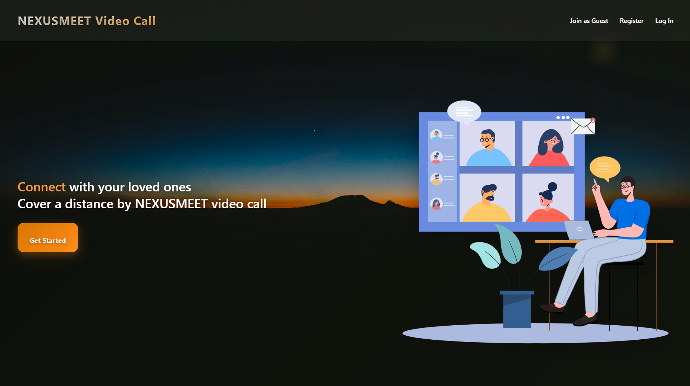
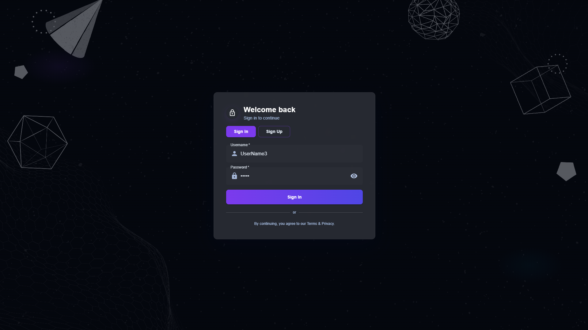
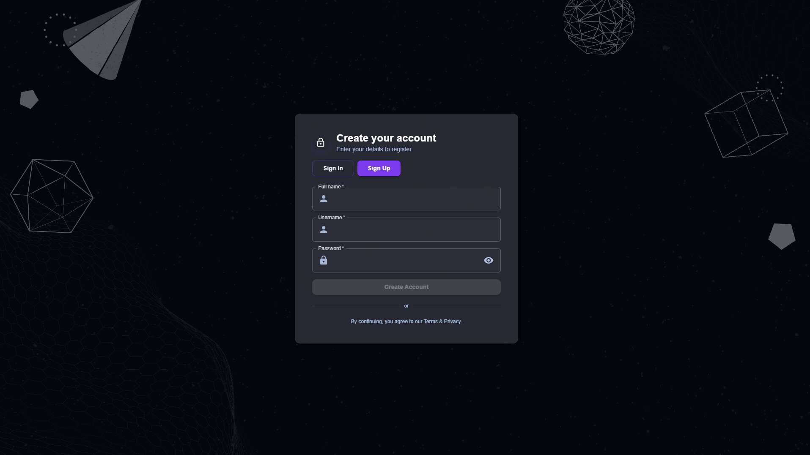
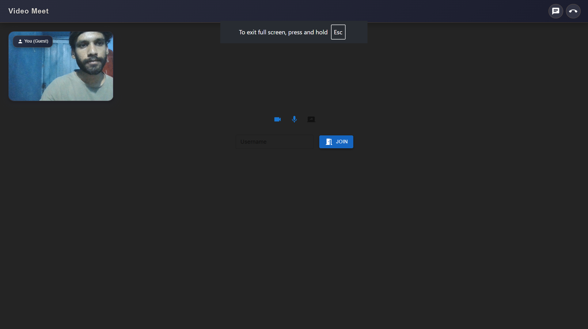
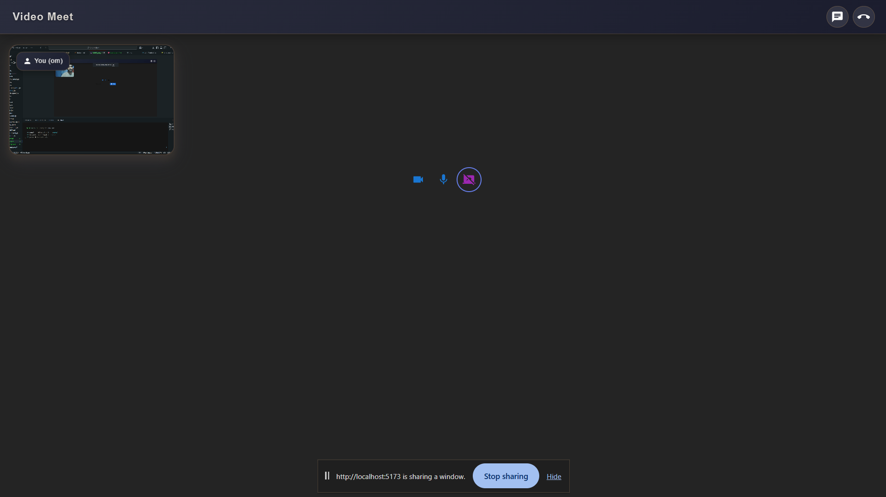
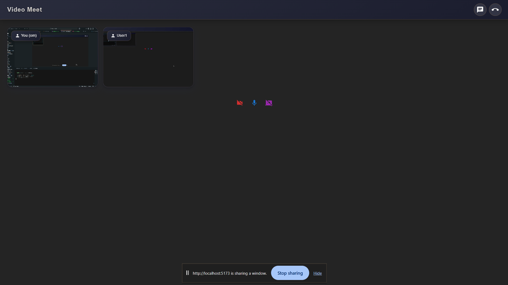

# NexusMeet

**A collaborative, proctor-aware meeting platform for education**

NexusMeet is a full‑stack web application built with React (Vite + Tailwind + MUI) on the frontend and Node.js + Express on the backend. It is designed for live online meetings and collaboration with special features for classroom scenarios: teacher/admin oversight, student interaction monitoring, and screen visibility (for supervision and feedback). The project is built with modularity in mind so it can evolve into a lab management system (future integration with *Comsy*-style features).

---

## Vision

Enable instructors and administrators to run secure, interactive online classes where they can:

* See **who’s active** and how students interact (chat, raised hands, participation).
* **Monitor student screens** (with consent and privacy safeguards) to verify task progress during lab sessions or timed assignments.
* Provide timely **feedback and intervention** when students are stuck.
* Collect classroom analytics (attendance, participation, task completion) to inform teaching decisions and automate grading/workflow where appropriate.

The long-term goal is to extend NexusMeet into a classroom/lab management platform (like **Comsy**) that pairs live meetings with attendance, device monitoring, issue reporting, and role-based dashboards for teachers and admins.

---

## Key Features

---
## 📸 Preview  
---

  
---
---
  
---
---
  
---
---


---
---


---
---
  
---

👉 Watch it in action:  
- [Landing Demo](./ReadmeIMG/Landing.mp4)  

- [Landing Page Demo](./ReadmeIMG/landingpg.mp4)  
- [Login Page Demo](./ReadmeIMG/Loginpg.mp4)
- [Login Page Demo](./ReadmeIMG/MVPfunctionality.mp4)  

---

### Core (Existing)

* JWT-based Authentication (Register / Login)
* Real-time meetings (WebRTC / Socket.io integration)
* Responsive landing & meeting UI (Tailwind + Material UI)
* REST API endpoints for users, meetings, and basic session data

### Education & Supervision (New / Proposed)

* **Instructor Dashboard**: Active users list, current meeting state, raised hands, polls, and quick actions (mute, spotlight, private note).
* **Admin Console**: View aggregated classroom analytics, user management, and session logs.
* **Screen View (Monitor Mode)**: Professors can request view-only access to a student’s screen during labs (opt-in, encrypted stream) for quick checks and demonstrations.
* **Task / Assignment Tracking**: Teachers can assign in-meeting tasks and see per-student completion status in real time.
* **Attendance & Activity Logs**: Automated attendance with session durations and activity markers (e.g., camera on/off, mic on/off, focus/blur events).
* **Issue Reporting & Ticketing**: Students can flag problems (network, environment, code errors) — tickets are visible to lab admins.

---

## Roles & Permissions

* **Student**: Join meetings, share screen (with permission), respond to polls, submit tasks.
* **Instructor (Teacher)**: Start/stop meetings, request screen view, assign tasks, view student activity, generate reports.
* **Admin**: Manage users, configure institution settings, access cross-class analytics and logs.

---

## High-level Architecture

* **Frontend (React + Vite)**: UI components, meeting controls, screens for dashboard and monitoring.
* **Backend (Node.js + Express)**: REST API, authentication, role-based access, meeting/session metadata.
* **Realtime (Socket.io)**: Presence, chat, live meeting control signals.
* **Media (WebRTC)**: Peer-to-peer video/audio + selective screen-sharing streams.
* **DB (MongoDB)**: Users, meetings, sessions, tasks, logs, analytics.

> The design prioritizes minimal central storage of media — only metadata and session audit logs are stored. Screen view streams are ephemeral and peer-to-peer or relayed through TURN only when necessary.

---

## Security & Privacy Considerations

* Explicit consent required before enabling any instructor screen view for a student.
* Use HTTPS and secure JWT storage (httpOnly cookies recommended for production).
* Limit logged PII; store only what’s necessary for classroom functionality.
* Implement role-based authorization checks on every endpoint.
* Add optional institutional policy pages and consent workflows (for GDPR/FERPA compliance depending on region).

---

## Installation & Quick Start

> Assumes you have Node.js, npm (or yarn), and MongoDB installed.

1. Clone repo

```bash
git clone https://github.com/OmBarabhai/NexusMeet.git
cd NexusMeet
```

2. Backend

```bash
cd backend
cp .env.example .env # edit values (MONGO_URI, JWT_SECRET, FRONTEND_URL, etc.)
npm install
npm run dev
```

3. Frontend

```bash
cd ../frontend
npm install
npm run dev
```

4. Open the app: visit the URL shown by Vite (default: [http://localhost:5173](http://localhost:5173))

---

## Environment Variables (example)

```
MONGO_URI=
JWT_SECRET=
PORT=8000
FRONTEND_URL=http://localhost:5173
TURN_SERVER_URL=...
```

---

## Suggested API Endpoints (overview)

* `POST /api/v1/users/register` — register
* `POST /api/v1/users/login` — login
* `GET /api/v1/users/me` — current user
* `POST /api/v1/meetings` — create meeting (teacher/admin)
* `GET /api/v1/meetings/:id` — meeting metadata
* `POST /api/v1/meetings/:id/tasks` — create assignment/task
* `GET /api/v1/meetings/:id/attendance` — attendance report
* `POST /api/v1/monitor/request` — instructor requests screen view (creates consent ticket)
* `POST /api/v1/monitor/consent` — student grants/denies consent

---

## Data Model Highlights

* **User**: `{ _id, name, email, role, institutionId, createdAt }`
* **Meeting**: `{ _id, hostId, title, participants, startTime, endTime, tasks[] }`
* **Task**: `{ id, title, description, dueInMeeting, statusByUser: { userId: status } }`
* **MonitorRequest**: `{ requestId, meetingId, requesterId, targetUserId, status, createdAt }`

---

## UX Notes & Wireframe Hints

* Instructor dashboard: split view — left column participants list + activity, right column meeting preview and task panel.
* Monitor Mode: show a small confirmation overlay explaining privacy and scope before enabling a view.
* Notifications: real-time small toasts for consent requests, new tasks, and raised hands.

---

## Future Scope — "Comsy" Integration & Roadmap

1. **Comsy-style Lab Management**

   * Centralized lab device registry (IP/host mapping), remote update capability (e.g., push software updates), and lab scheduling.
   * Role-based dashboards for lab technicians (issue queue, machine health, usage reports).

2. **Deeper Analytics & Auto Reports**

   * Participation scoring, attention heatmaps (high-level), assignment completion trends.

3. **Learning Tools Integration**

   * LMS/LTI connectors to sync assignments and grades with Canvas/Moodle.

4. **Proctoring & Secure Exams** (opt-in and comply with privacy laws)

   * Secure exam mode: restricted browsing, automatic screen capture (with policies), and suspicious activity flags.

5. **Enterprise/Institution Onboarding**

   * SSO support (SAML/OAuth), multi-tenant data isolation, centralized billing and usage dashboards.

---
