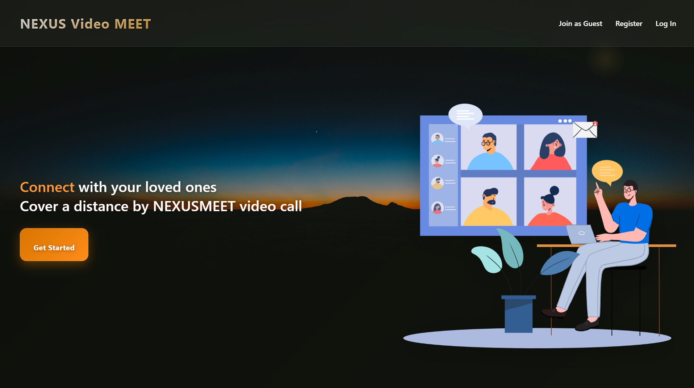

# 🚀 NexusMeet  

A full-stack web application for **seamless online meetings & collaboration**.  
Built with **React (frontend)** and **Node.js/Express (backend)**, NexusMeet provides a modern interface for authentication, meetings, and communication.  

---

## 📸 Preview  
  
  
  


👉 Watch it in action:  
- [Landing Page Demo](./ReadmeIMG/landingpg.mp4)  
- [Login Page Demo](./ReadmeIMG/Loginpg.mp4)  

---

## ✨ Features  
- 🔐 Secure Authentication (JWT-based login & registration)  
- 🖥️ Modern Landing Page with responsive UI  
- 🎨 Tailwind CSS + Material UI styled components  
- 📡 REST API with Express.js backend  
- 📦 Modular project structure (frontend + backend)  

---

## 🛠️ Tech Stack  
**Frontend:** React, Vite, TailwindCSS, Material UI  
**Backend:** Node.js, Express.js  
**Database:** MongoDB (or your DB here)  
**Version Control:** Git & GitHub  

---

## ⚙️ Setup Instructions  

### 1️⃣ Clone the repository  
```bash
git clone https://github.com/OmBarabhai/NexusMeet.git
cd NexusMeet
